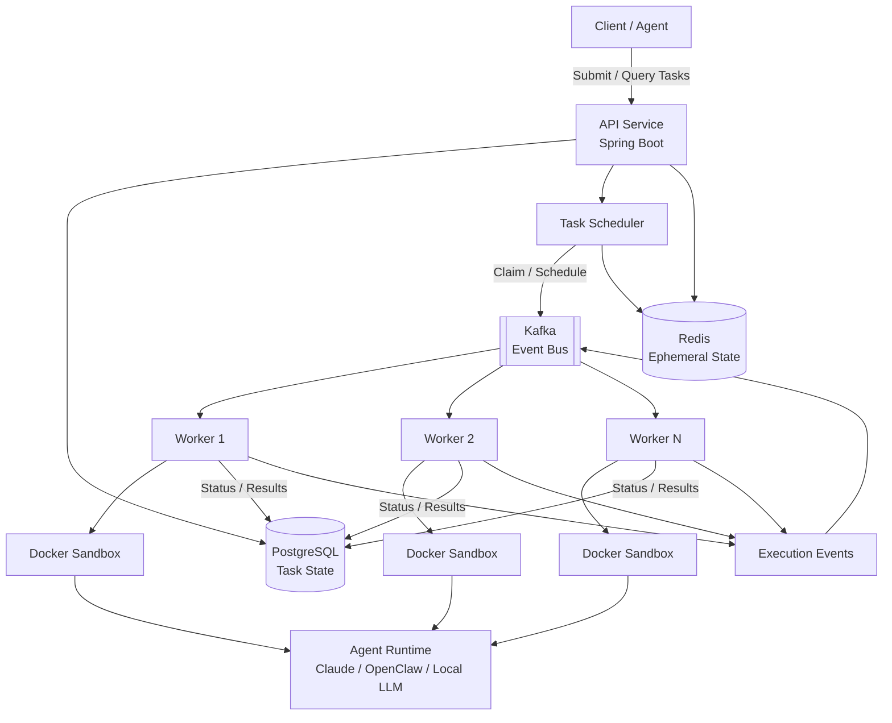

## Architecture



### Core Components

| Component            | Responsibility                                                              |
| -------------------- | --------------------------------------------------------------------------- |
| **API Service**      | Accepts tasks, exposes task status, and provides execution history          |
| **PostgreSQL**       | Stores durable task state, worker assignments, leases, retries, and results |
| **Scheduler**        | Assigns tasks to workers and handles scheduling policies                    |
| **Kafka**            | Provides asynchronous task and execution-event communication                |
| **Workers**          | Execute tasks and manage agent runtimes                                     |
| **Docker Sandboxes** | Isolate each agent execution and limit resources                            |
| **Agent Runtime**    | Performs the actual coding task using Claude, OpenClaw, or a local LLM      |
| **Redis**            | Stores ephemeral coordination and fast-access state                         |
| **Execution Events** | Tracks task lifecycle, logs, failures, and worker activity                  |

### Execution Flow

```text
Client
  ↓
API Service
  ↓
PostgreSQL
  ↓
Scheduler
  ↓
Kafka
  ↓
Worker
  ↓
Docker Sandbox
  ↓
Agent Runtime
  ↓
Result / Events
  ↓
PostgreSQL + Kafka
```

The architecture is intentionally built around **reliable distributed execution** rather than the agent itself. The agent is treated as a workload that can be swapped independently from the underlying execution infrastructure.
